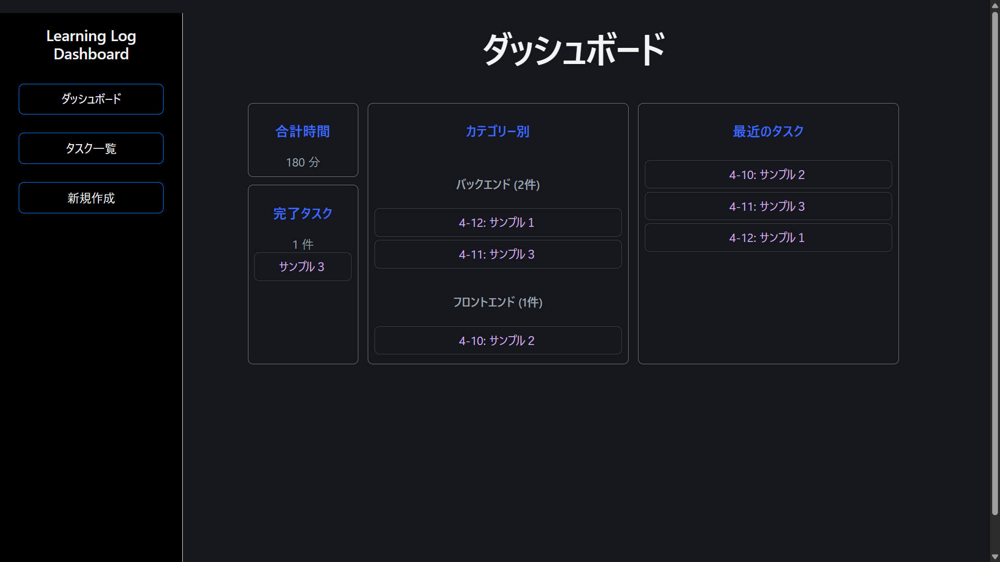
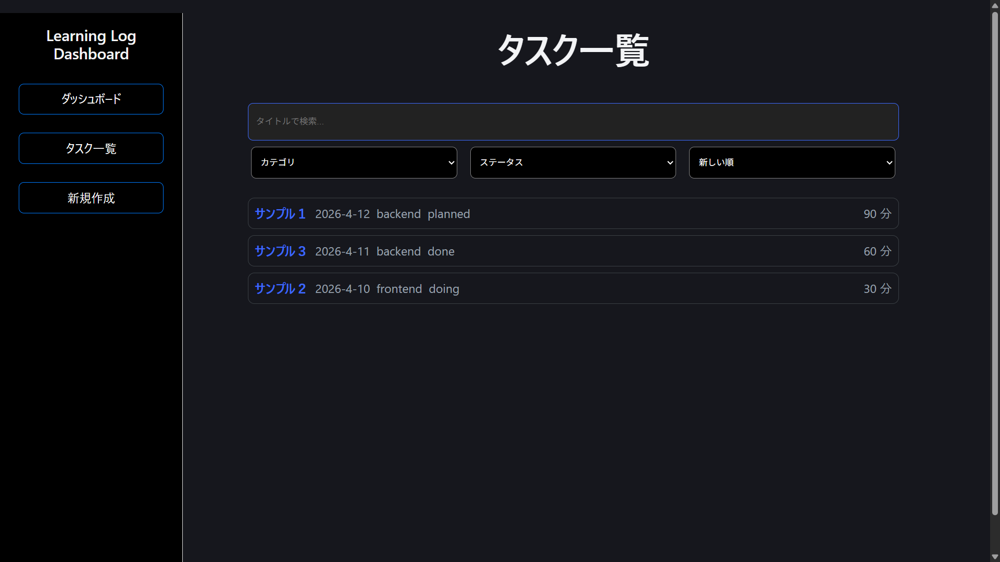

# Learning Log Dashboard


## アプリ概要

学習や作業の記録を管理するためのシングルページアプリ（SPA）です。主にプログラミング学習者を対象としています。

ログの作成・編集・削除や、検索・絞り込みを行うことができます。


## 起動方法

```bash
npm install
npm run dev
```

ブラウザで以下にアクセス

```
http://localhost:5173
```


## 使用技術

- React (Vite)
- react-router-dom
- JavaScript
- localStorage


## 機能一覧

### ■ ダッシュボード (`/`)

- 合計学習時間
- 完了ログと件数
- 最近のログ一覧（日付が新しい順）
- カテゴリ別のログと件数

### ■ 一覧画面 (`/logs`)

- キーワード検索
- カテゴリ絞り込み
    - バックエンド/フロントエンド/インフラ/システム等
- ステータスフィルタ
- 並び替え（新しい順 / 古い順/時間が長い順）
- URLクエリパラメータで状態保持

### ■ 詳細画面 (`/logs/:id`)

- 記録の詳細表示
- 存在しないIDの場合は”"存在しない"と表示
- バリデーション
- 削除/編集/戻るボタン
- 削除時確認ダイアログあり

### ■ 新規作成 (`/logs/new`)

- controlled component によるフォーム
- バリデーション

### ■ 編集画面 (`/logs/:id/edit`)

- 初期値の読み込み
- 保存/キャンセルボタン

### ■ 404画面(`/*`)

- ログ一覧画面とホーム画面に戻るリンク

### ■ サイドバー(ナビゲーション)

- ダッシュボード
- ログ一覧
- 新規作成

### ■ その他

- localStorageが空ならモックデータを使う
    - ユーザが新規作成したらモックデータは表示しない
    - localStorage によるデータ永続化


## スクリーンショット




## 工夫した点

- mockデータをstateで管理し、ユーザが作ったデータとは分離化
- 編集時は入力したフォームが残り続ける可能性があるので、keyを設定してidが変わればリセットするようにした。
- 新規作成と編集画面の入力フォームをコンポーネントとし切り離した


## ディレクトリ構成

```
Learning-Log-Dashboard/
├─ README.md
├─ AI_USAGE.md
├─ docs
|  └─ IMPLEMENTATION_NOTES.md
├─ index.html
└─ src/
   ├─ App.css
   ├─ App.jsx
   ├─ index.css
   ├─ main.jsx
   ├─ api/
   │  └─ api.jsx
   |
   ├─ components/
   │  ├─ Layout.jsx
   │  ├─ LogForm.jsx
   │  └─ css/
   │     ├─ Layout.css
   │     └─ LogForm.css
   |
   ├─ hooks/
   │  ├─ useDebounce.js
   │  ├─ useDocumentTitle.js
   │  ├─ useLocalStorage.js
   │  └─ useLogsFilter.js
   |
   ├─ pages/
   │  ├─ CreateLogPage.jsx
   │  ├─ Home.jsx
   │  ├─ LogDetailsPage.jsx
   │  ├─ LogEditPage.jsx
   │  ├─ LogsListPage.jsx
   │  ├─ NotFoundPage.jsx
   │  └─ css/
   │     ├─ Home.css
   │     ├─ LogDetails.css
   │     └─ LogList.css
   |
   └─ utils/
      └─ labels.js
```